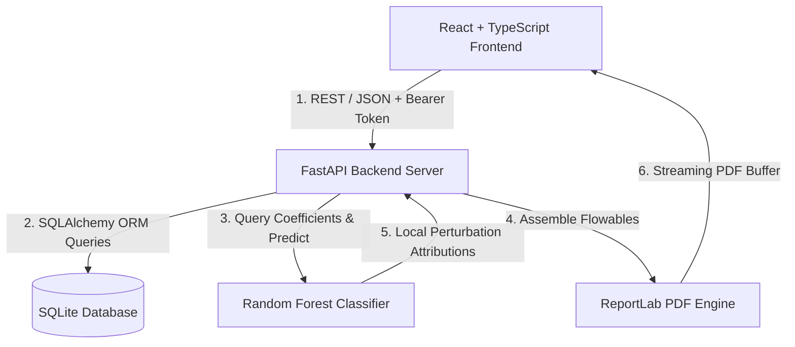
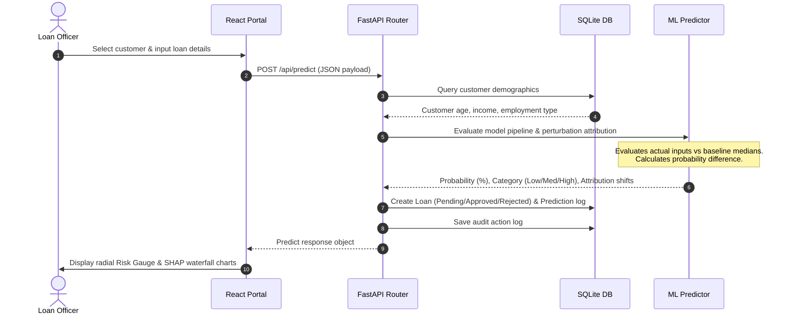

# System Architecture - Loan Default Prediction System

The Loan Default Prediction System is designed as a modern, split-tier web application combining responsive portal features with machine learning credit scoring services.

---

## 1. System Topology

Below is the structure representing the client-server relationships:

---

## 2. Component Design

### Tier 1: Frontend Single Page Application (SPA)
- **Framework**: React 18 with Vite and TypeScript.
- **Styling**: Tailwind CSS for responsive dark/light banking design.
- **Visuals**: Recharts for interactive credit distributions, default rates, and SHAP attribution bars.
- **Authentication**: JWT token storage in local state, forwarded in `Authorization` headers.

### Tier 2: Backend REST Services
- **Framework**: FastAPI (Python) running under Uvicorn.
- **Routing**: Split into modular routers: login, customers, predictions, stats dashboard, report rendering, and model diagnostics.
- **Security**: JWT encryption using `python-jose` with password hashing under `passlib[bcrypt]`.
- **Database Engine**: SQLAlchemy ORM interacting with an SQLite database file.

### Tier 3: Machine Learning Engine
- **Framework**: Scikit-learn (Random Forest Classifier).
- **Pipeline Structure**: Combines StandardScaler (numerical scaling) and OneHotEncoder (categorical encoding) into a unified joblib pipeline.
- **Explainability (SHAP-like)**: Computes local feature attribution shifts by comparing predictions from actual client data inputs against population-level median/mode baselines.

---

## 3. Sequential End-to-End Prediction Flow

